从句 关键在于 连词

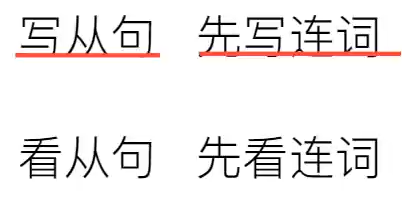

# 连词1 that whether

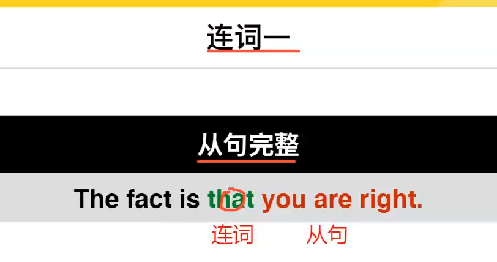

大部分连词不用if

# 连词2  who  whom

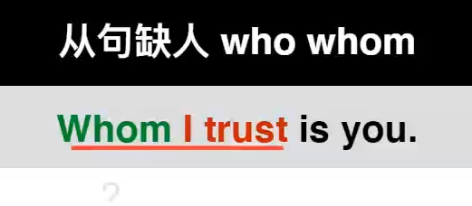

缺少宾语

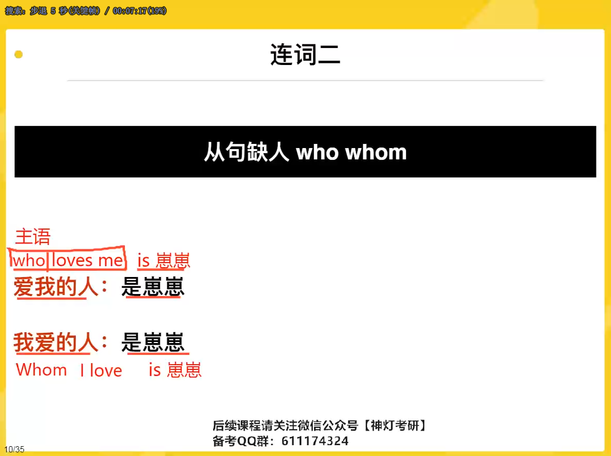

# 连词3  what

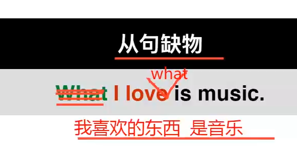

# 连词4 where when why how

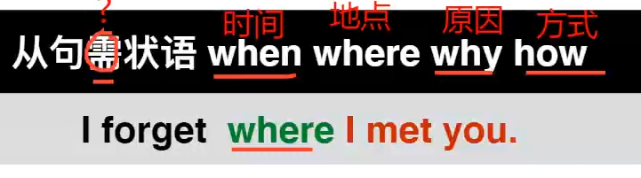

# 总接

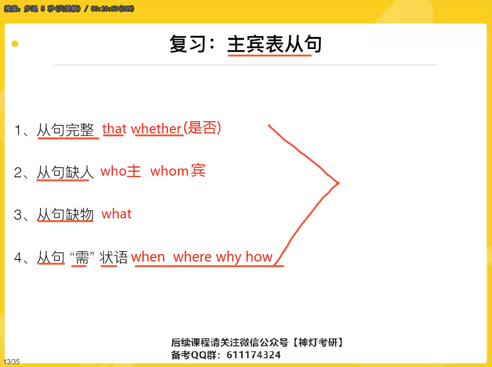

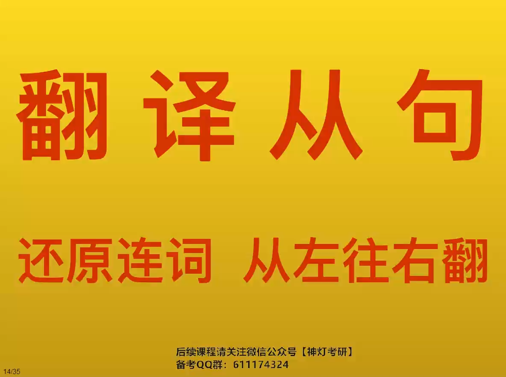

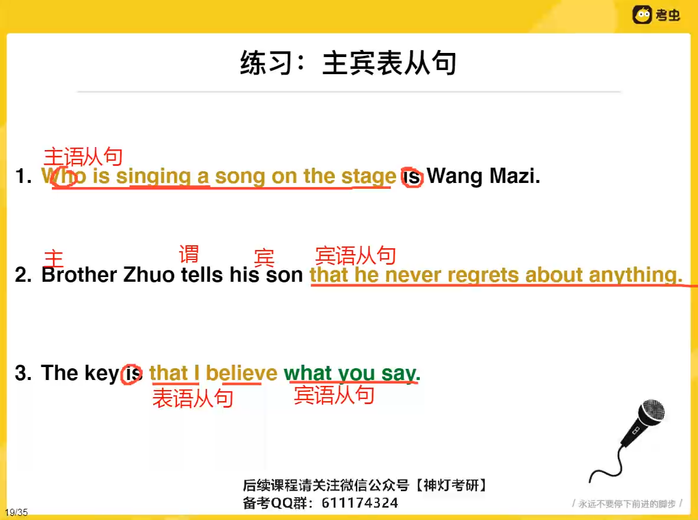

# 特殊主语从句 

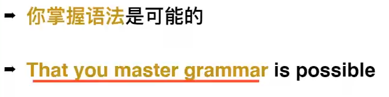

zhuyu从句太长

(这句话) 是…

# 宾语从句

介词后

及物动词后

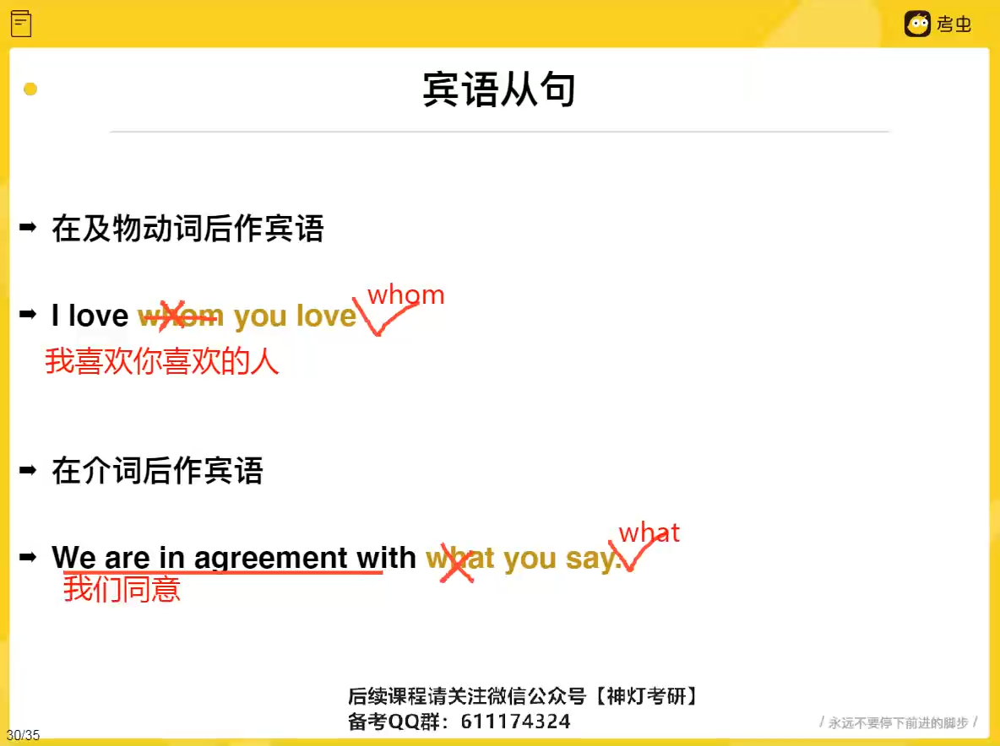

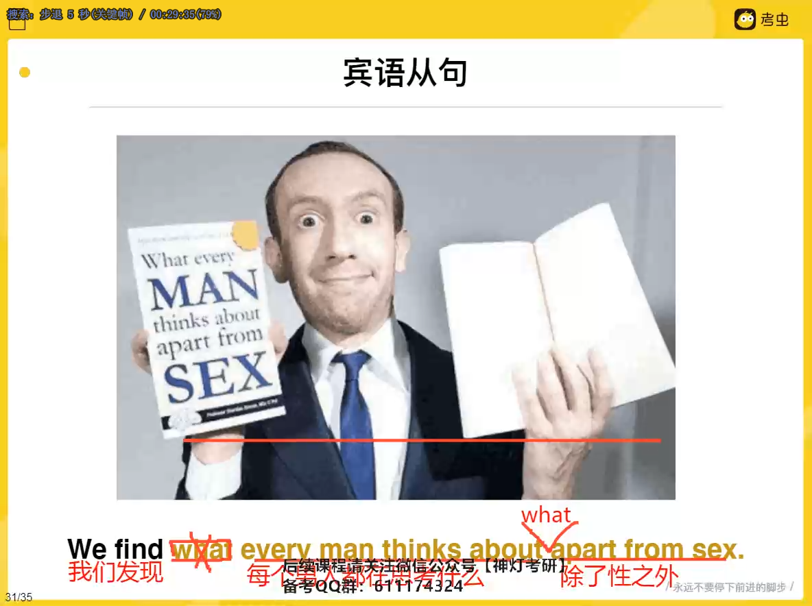

介词后接名词   接what 》按顺序翻译

# 表语从句

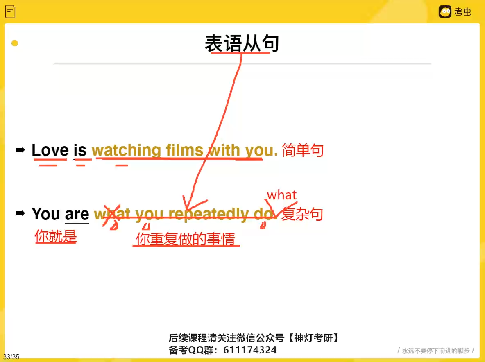

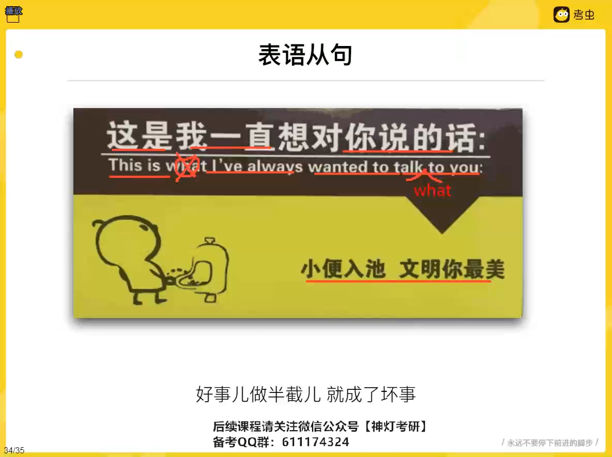

# fuxi

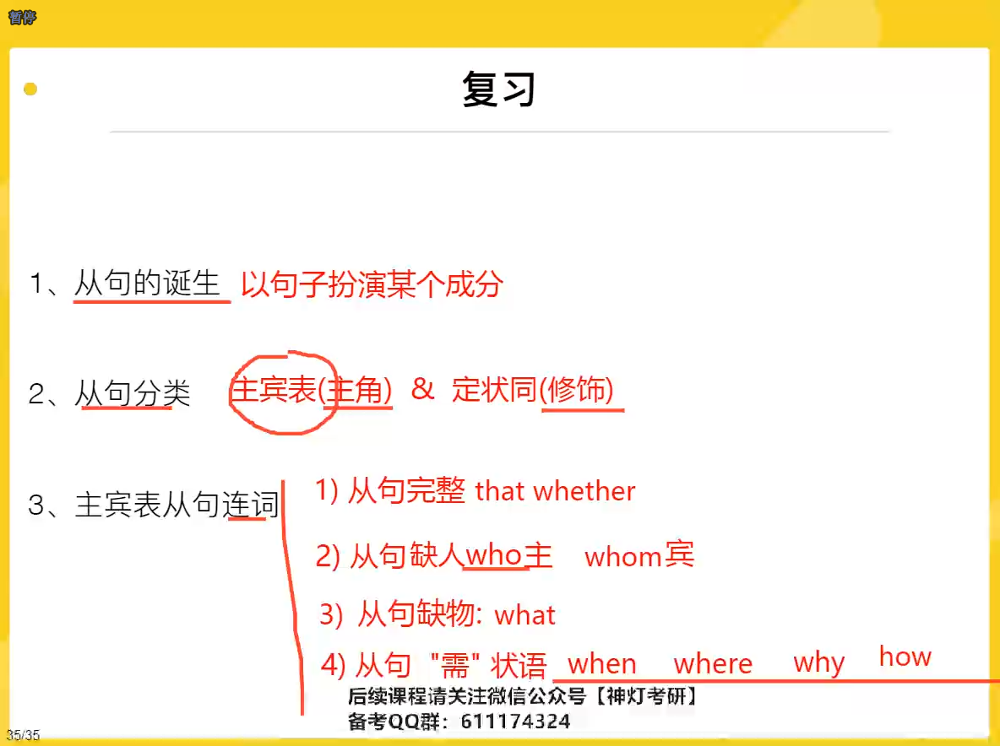
