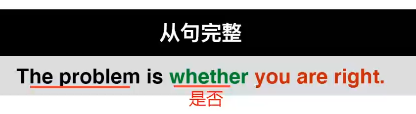
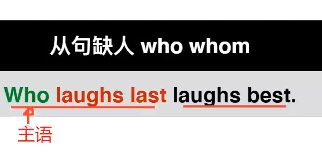
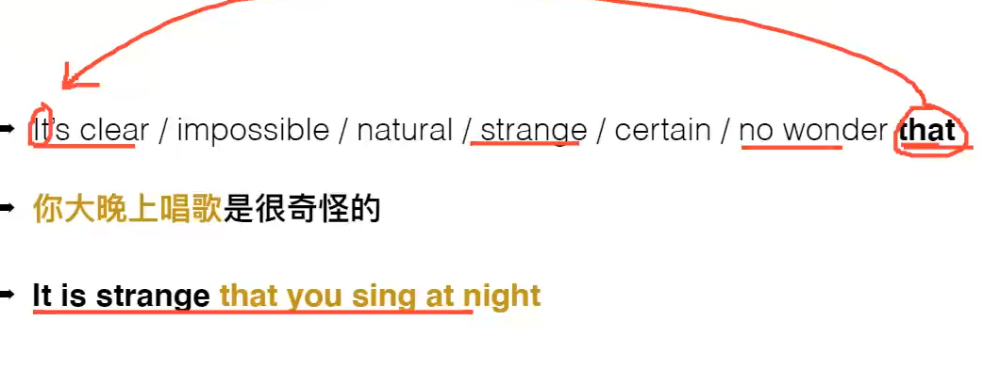

从句 关键在于 连词

# 连词1 that whether

大部分连词不用if

# 连词2  who  whom

缺少宾语

# 连词3  what

# 连词4 where when why how

# 总接

# 特殊主语从句 

zhuyu从句太长

(这句话) 是…

# 宾语从句

介词后

及物动词后

介词后接名词   接what 》按顺序翻译

# 表语从句

# fuxi

