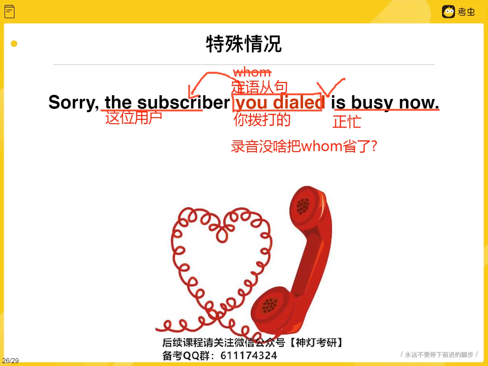

# all

# 同位语从句

删掉不影响句子， 说明是修饰性成分

抽象名词 用同从

# 定语从句

定语修饰 成分

形容词前置 ， 从句后置

# 定语从句连词 who whom which that

修饰先翻译

# 非限定性定语从句  ，which

，which 

# 介词+which

​	

砍掉介词， 还原到空缺

# 特殊情况

定语从句   连接词是宾语是可以省略

whom 省略

# 状语从句

​	

