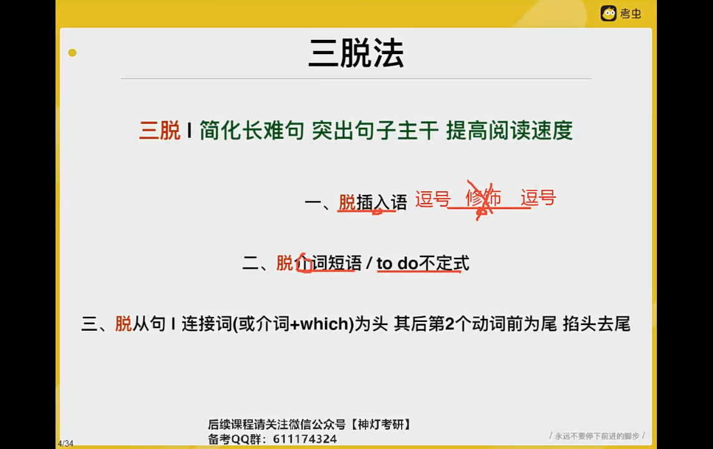
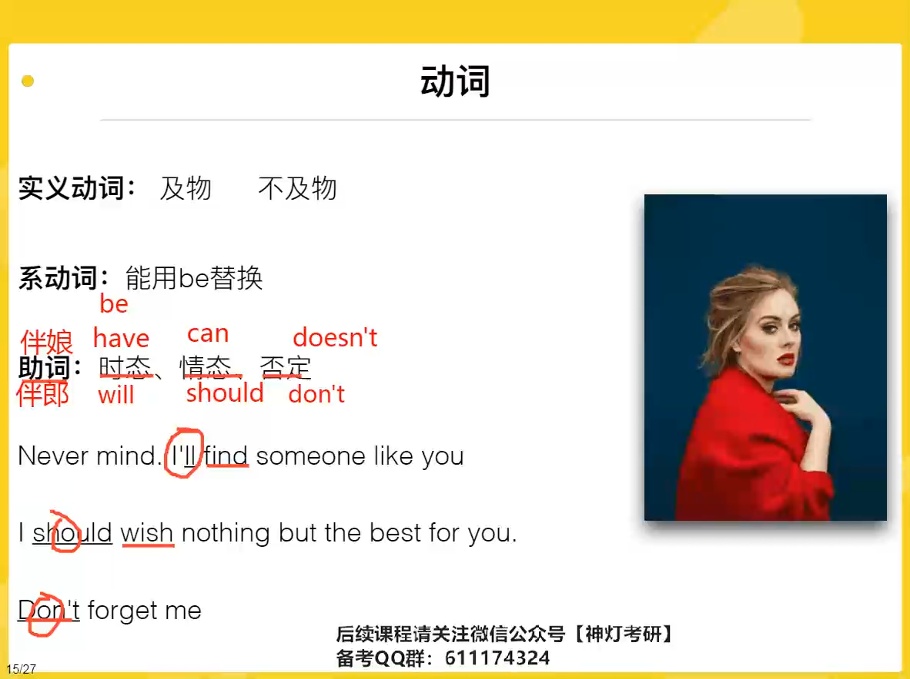
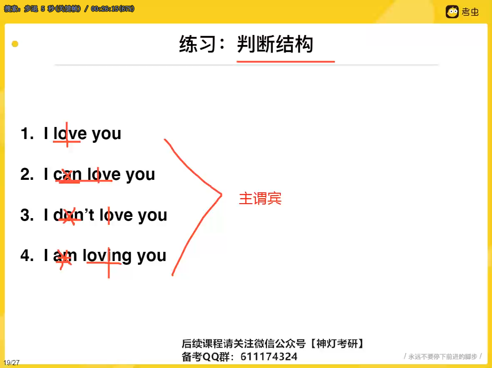
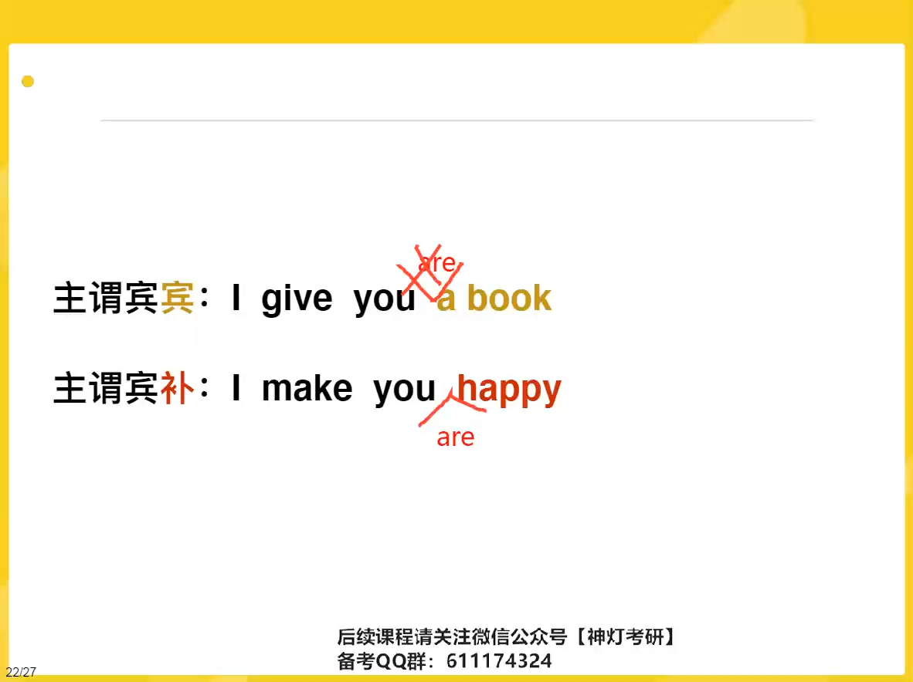
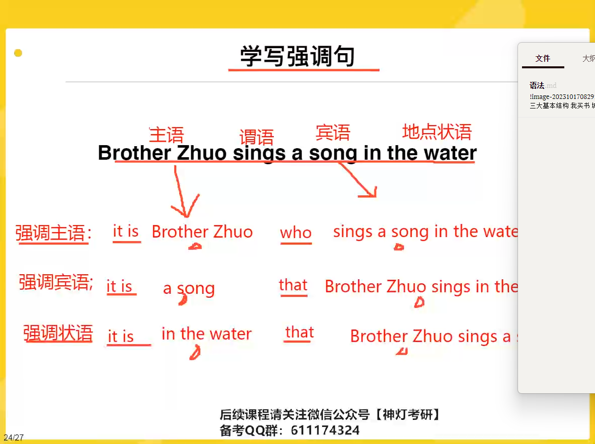

1. 插入语 	`，定状同，`

# 三大基本结构

 我买书		 城市修地铁

她是学生   她很漂亮   他变得很漂亮

我哭		旗袍出现  旗袍经常出现在世界级的时装秀上

# 动词

实义动词  机务不及物 有没有对象

系动词

**及物      主谓宾**

**系动		主系表**

**不及物		主谓**

he sucks.  

助词不印象结构

# 三大特殊结构

接be

主谓宾宾     两种表达方式

i give you a book

i give a book for you 

强调句

强调主语宾语状语

it is + … + 

  

