# all

1.  扫读题干
    1. 横扫：看懂每一题问什么
    2. 找到5道题共性联系 
2.  处理文章
    1. 主题结构： 主旨+逻辑结构（之后讲
       1. 找主题词
          1. 大多数题干中反复出现
          2. 大多数段落反复出现   
             1. 大写词往上查找重复
          3. 主题词不能用于定位
       2. 文章中前四分之一找主题句（包含主题的结论句）
          1. 抓住主题词 找主题句
          2. there be 
          3. 最高级  ， 极端词语
          4. 转折后 
    2. 出题点 ：  定位 + 考点
       1. 30-35句话 -》 10-15个出题点 -》5个题5个出题点
       2. 定位：根据题干的信息找到在文章中答案的出处（本题独有，明显信息，专有名词，数字时间….
          1. 选项中的代词回题王中找对；原文中的代词上一句找对应
          2. 题干中出现比较， 用ta来定位 ；
             1. 选项中出现比较， 回原文找
             2. 若是极端比较， 原文有就可以选
       3. 考点：（之后讲
3.  对比作答
    1. 正确选项是原文的精确改写
    2. 题干 -》原文-》选项
    3. 精确改写 
       1. 形式对应  （因果，并列，[比较](D:\Desktop\English_CET4\阅读\2_比较考点.md )，转折
          1. 原文有比较， 对应的选项应该有比较
          2. 排比无重点，出题点在前后句
             1. 更重要的… 
             2. 共性总结  generally speaking
          3. 转折
             1. but 句：  前后不一致； 作者立场
       2. 含义对应  （同义替换

# 规则

标准化文章3-7段  定位在那一段， 答案在那一段

8段及以上    定位在本段  下段  上段  

第一题一定与文章主题相关

四级没有需要综合全文得出来的题 

不要先看选项再找对应原文

​	看选项在文章以前见过，危险

我对于文章理解…会出现偏差， 最好的解决办法是一词对照

每篇仔细阅读 有一道难度大

科技类文章，看不懂，把题目找到就ok

不根据常识做题

排除法，高分必备	

正话反说 

	1.  a比b多
	1.   yy很纯洁  yy污

大写专有名词作为选项 大概率是干扰选项

看着看着忘了问题用其他地方信息排除正确选项 -》 看定位点信息，

每一题目 原文与选项连上是唯一标准， 不是简单与否， 不是简单就不是答案。。

推断题， 不要推，直接找结论

# 词汇：

解决生词

熟词僻义

同义替换

# 知识

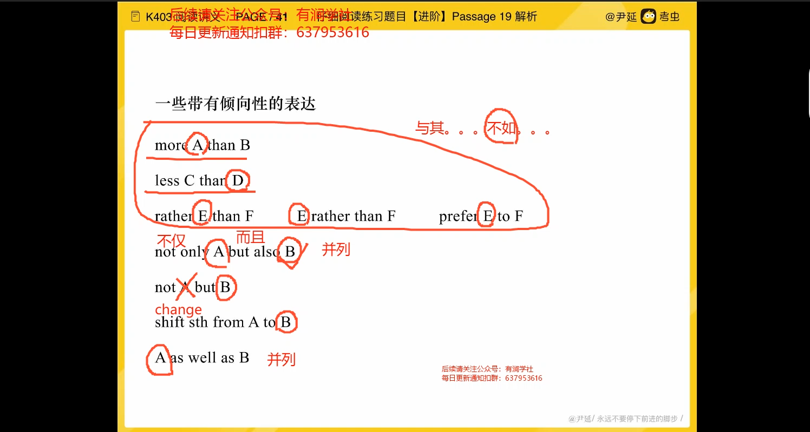

# 标准化文章

3-7段  定位在那一段， 答案在那一段

8段及以上    定位在本段  下段  上段  

第一题一定与文章主题相关

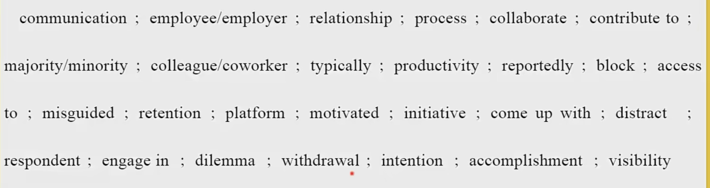

# 做题方法

# 1

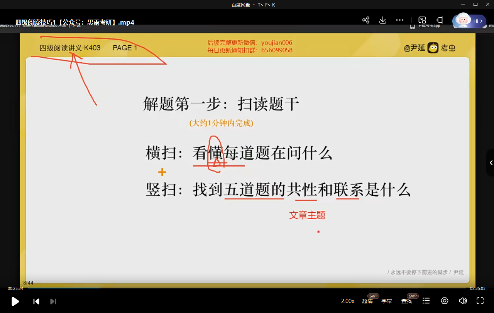

# 2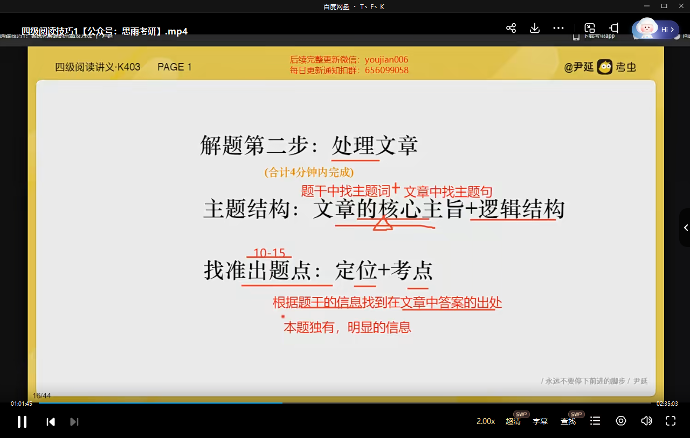

定位点：本题独有，明显

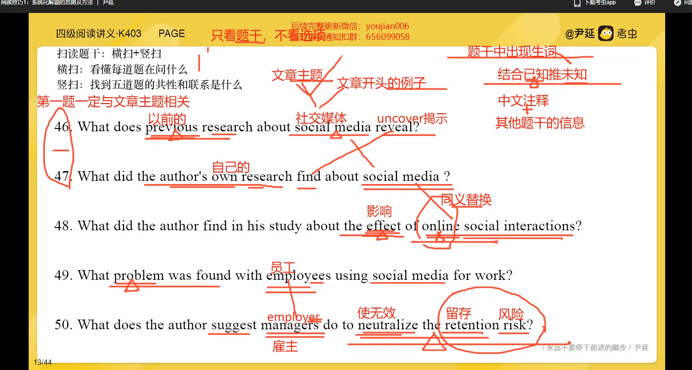

明显信息  大写专有名词 数字时间

没有需要综合全文得出来的题 

**找到题目的定位就立刻做题**

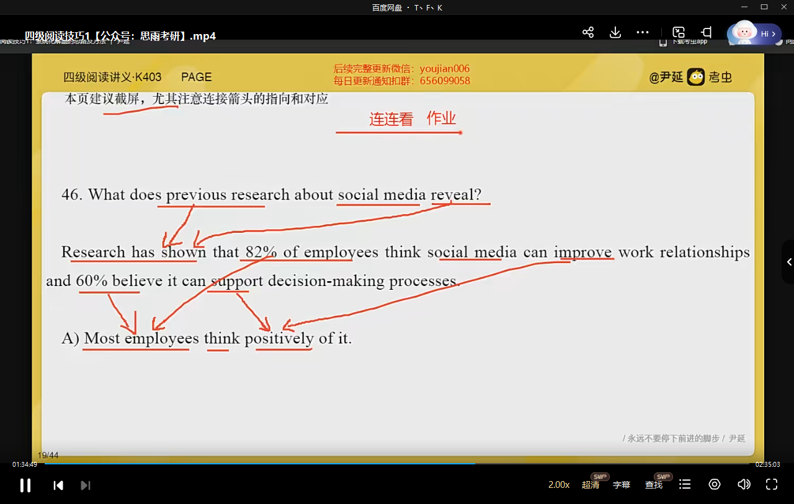

# 3

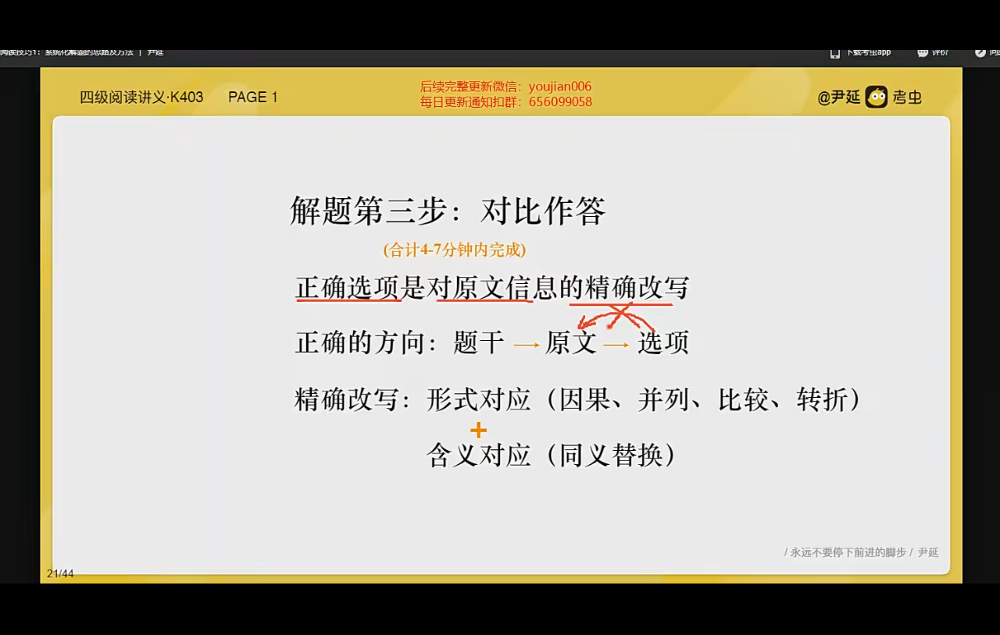

题干 》 原文 》 选项 

不要先看选项 找对应原文

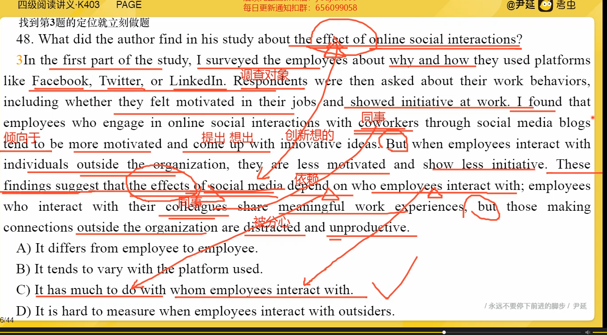

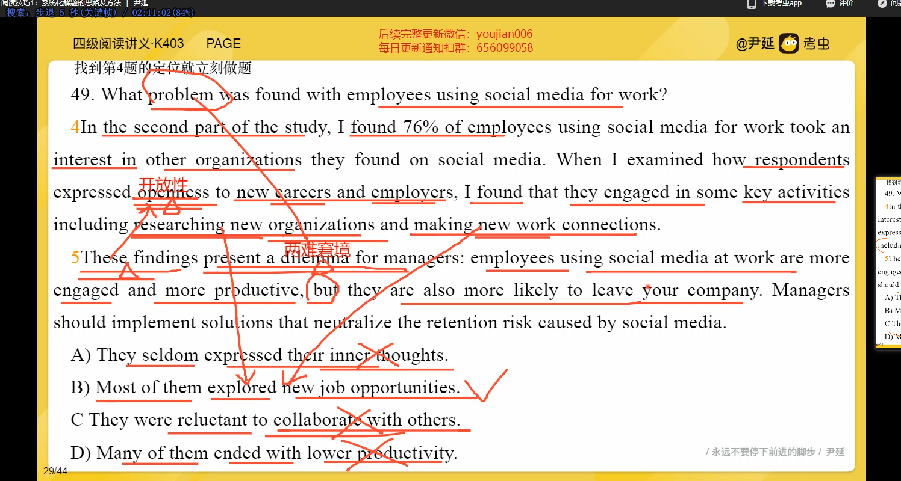

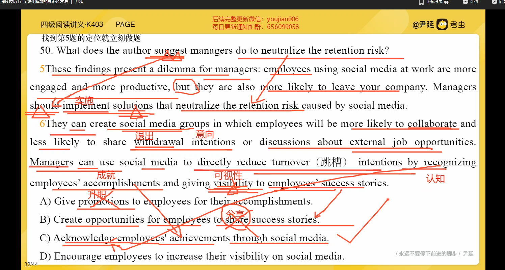

# 流程

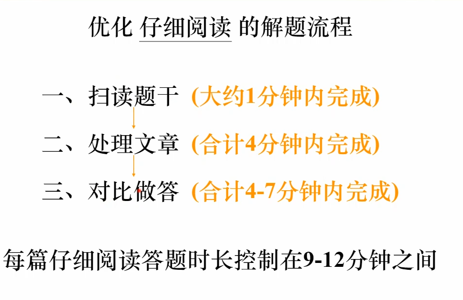

