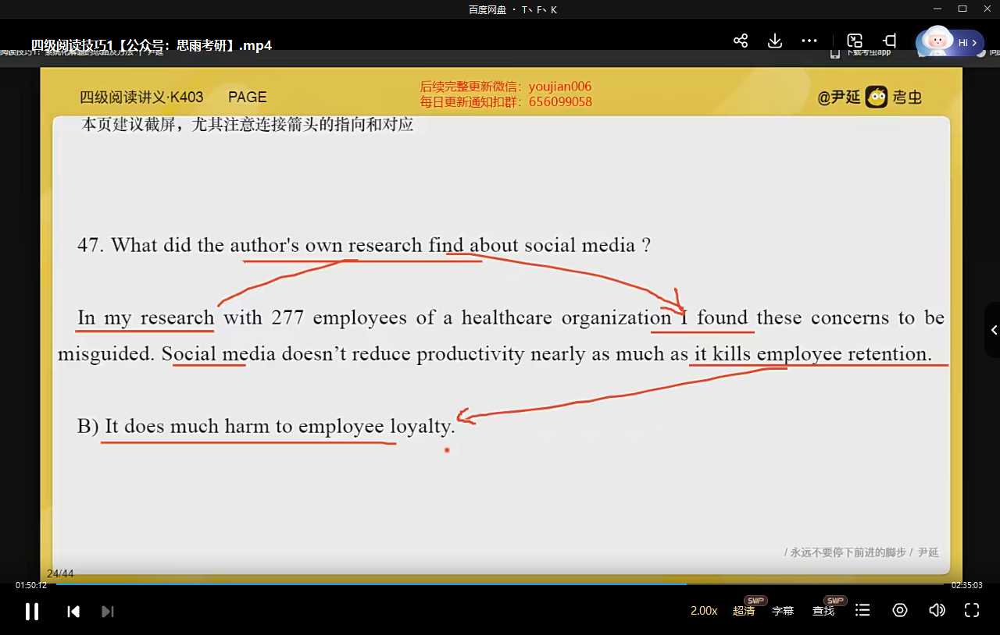

# 词汇：

解决生词

熟词僻义

同义替换

# 标准化文章

3-7段  定位在那一段， 答案在那一段

8段及以上    定位在本段  下段  上段  

第一题一定与文章主题相关

# 做题方法

# 1

# 2

明显信息  大写专有名词 数字时间

没有需要综合全文得出来的题 

**找到题目的定位就立刻做题**

# 3

题干 》 原文 》 选项 

不要先看选项 找对应原文

